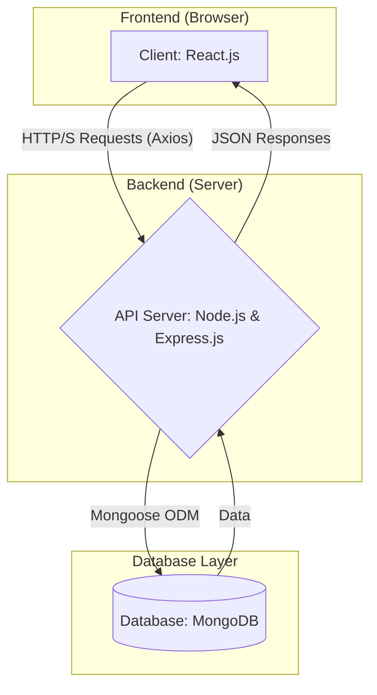

Of course! Here is a detailed project black book/technical documentation for an "Attendance Management System" using the MERN stack, formatted in Markdown.

---

# Attendance Management System - Project Documentation

**Version:** 1.0.0
**Date:** October 26, 2023
**Tech Stack:** MongoDB, Express.js, React.js, Node.js (MERN)

---

## 1. Abstract

The Attendance Management System is a comprehensive web application designed to streamline and automate the process of tracking student attendance. Traditional paper-based methods are inefficient, prone to errors, and difficult to manage. This project provides a digital solution with a centralized database and an intuitive user interface.

The system caters to three primary roles: **Admin**, **Faculty**, and **Student**.
-   **Admins** have full control over the system, including managing users (faculty, students), courses, and departments, as well as generating comprehensive attendance reports.
-   **Faculty** can mark and update attendance for the courses they are assigned to.
-   **Students** can log in to view their own attendance records for all their courses.

Built on the MERN stack, the application leverages the power of a non-relational database (MongoDB), a robust backend API (Express.js on Node.js), and a dynamic, single-page frontend (React.js) to deliver a fast, scalable, and user-friendly experience.

---

## 2. Architecture

The application follows a classic three-tier client-server architecture.



### 2.1 Frontend (Client-Side)

-   **Framework:** React.js
-   **Responsibilities:**
    -   Rendering the user interface (UI) and all components.
    -   Managing client-side state (e.g., using Context API or Redux).
    -   Handling user interactions and routing (using React Router).
    -   Communicating with the backend API via HTTP requests (using Axios) to fetch and send data.
    -   Implementing role-based access control on the UI to show/hide components based on user permissions.

### 2.2 Backend (Server-Side)

-   **Framework:** Express.js running on Node.js
-   **Responsibilities:**
    -   Providing a RESTful API for the frontend to consume.
    -   Handling business logic (e.g., calculating attendance percentages).
    -   User authentication and authorization using JSON Web Tokens (JWT).
    -   Validating incoming data from the client.
    -   Interacting with the MongoDB database via the Mongoose ODM (Object Data Modeling).

### 2.3 Database

-   **Database:** MongoDB (NoSQL)
-   **Responsibilities:**
    -   Persisting all application data.
    -   Storing data in a flexible, JSON-like format (BSON).
-   **Core Data Models (Schemas):**
    1.  **User:** Stores information about all users (Admins, Faculty, Students). Includes credentials, role, and personal details.
    2.  **Course:** Stores details about courses, including the assigned faculty and enrolled students.
    3.  **AttendanceRecord:** A collection that stores individual attendance entries. Each document links a student, a course, a date, and their status (e.g., 'Present', 'Absent').

---

## 3. Setup & Installation

Follow these steps to set up the project locally.

### 3.1 Prerequisites

-   Node.js (v16.x or later)
-   npm (v8.x or later) or yarn
-   MongoDB (local instance or a cloud service like MongoDB Atlas)
-   Git

### 3.2 Backend Setup

1.  **Clone the repository:**
    ```bash
    git clone <your-repository-url>
    cd attendance-management-system
    ```

2.  **Navigate to the backend directory:**
    ```bash
    cd backend
    ```

3.  **Install dependencies:**
    ```bash
    npm install
    ```

4.  **Create a `.env` file** in the `backend` directory and add the following environment variables:
    ```env
    PORT=5000
    MONGO_URI=<your_mongodb_connection_string>
    JWT_SECRET=<your_strong_jwt_secret_key>
    ```

5.  **Start the backend server:**
    ```bash
    npm start
    ```
    The server should now be running on `http://localhost:5000`.

### 3.3 Frontend Setup

1.  **Navigate to the frontend directory** from the root project folder:
    ```bash
    cd ../frontend
    ```

2.  **Install dependencies:**
    ```bash
    npm install
    ```

3.  **Create a `.env` file** in the `frontend` directory (optional, for clarity) and specify the backend API URL:
    ```env
    REACT_APP_API_URL=http://localhost:5000/api
    ```
    If not specified, API calls will need to be proxied or use the full URL.

4.  **Start the React development server:**
    ```bash
    npm start
    ```
    The application should open automatically in your browser at `http://localhost:3000`.

---

## 4. File Structure

The project is structured as a monorepo with separate `frontend` and `backend` directories.

```
attendance-management-system/
├── backend/
│   ├── config/             # Database connection, etc.
│   │   └── db.js
│   ├── controllers/        # Logic for handling requests
│   │   ├── authController.js
│   │   ├── userController.js
│   │   ├── courseController.js
│   │   └── attendanceController.js
│   ├── middleware/         # Custom middleware
│   │   ├── authMiddleware.js   # JWT verification and role checks
│   │   └── errorMiddleware.js
│   ├── models/             # Mongoose schemas
│   │   ├── userModel.js
│   │   ├── courseModel.js
│   │   └── attendanceModel.js
│   ├── routes/             # API endpoint definitions
│   │   ├── authRoutes.js
│   │   └── ...
│   ├── .env                # Environment variables
│   ├── package.json
│   └── server.js           # Main entry point for the server
│
└── frontend/
    ├── public/
    │   └── index.html
    ├── src/
    │   ├── api/              # Functions for making API calls (Axios)
    │   │   └── index.js
    │   ├── assets/           # Images, CSS, etc.
    │   ├── components/       # Reusable React components (Button, Navbar, etc.)
    │   ├── context/          # React Context for state management
    │   │   └── AuthContext.js
    │   ├── hooks/            # Custom React hooks
    │   ├── pages/            # Page-level components (Login, Dashboard, etc.)
    │   │   ├── LoginPage.js
    │   │   ├── DashboardPage.js
    │   │   └── ...
    │   ├── App.js            # Main application component with routing
    │   └── index.js          # Entry point for the React app
    ├── .env
    └── package.json
```

---

## 5. Module Explanations

### 5.1 Authentication Module (Backend & Frontend)

-   **Functionality:** Handles user registration (primarily for initial admin setup), login, and logout.
-   **Backend:**
    -   Uses `bcrypt.js` to hash and compare passwords.
    -   Upon successful login, it generates a JSON Web Token (JWT) containing the user's ID and role.
    -   The `authMiddleware.js` is used to protect routes. It verifies the JWT from the `Authorization` header and attaches the user's information to the request object.
-   **Frontend:**
    -   Provides login forms to capture user credentials.
    -   Stores the JWT in `localStorage` or `sessionStorage` upon successful login.
    -   Uses an Axios interceptor to automatically attach the JWT to the header of all subsequent API requests.
    -   Handles logout by removing the token from storage.

### 5.2 User Management Module (Admin)

-   **Functionality:** Allows Admins to perform CRUD (Create, Read, Update, Delete) operations on users (Students and Faculty).
-   **Backend:** Provides API endpoints like `POST /api/users`, `GET /api/users`, `PUT /api/users/:id`, `DELETE /api/users/:id`. These routes are protected and restricted to the 'Admin' role.
-   **Frontend:** Displays a table of all users with options to add, edit, or delete them. A form is used to capture user details.

### 5.3 Course Management Module (Admin)

-   **Functionality:** Allows Admins to create new courses and assign faculty and students to them.
-   **Backend:** Endpoints for course CRUD operations. The `courseModel` uses references (`ref`) to link to documents in the `userModel` for the faculty and students.
-   **Frontend:** UI for viewing a list of courses, creating new ones, and a detailed view to manage student enrollment and faculty assignment for a specific course.

### 5.4 Attendance Module (Faculty & Student)

-   **Functionality:** The core module for marking and viewing attendance.
-   **Backend:**
    -   `POST /api/attendance`: Endpoint for a faculty member to submit attendance for a specific course on a given date. The request body contains an array of `{ studentId, status }`. The controller handles creating or updating records in the `attendanceModel`.
    -   `GET /api/attendance/course/:courseId`: Fetches all attendance records for a course.
    -   `GET /api/attendance/student/:studentId`: Fetches all attendance records for a single student.
-   **Frontend:**
    -   **Faculty View:** A page where the faculty selects a course and a date. It then displays a list of enrolled students with options (Present/Absent) to mark attendance.
    -   **Student View:** A dashboard where the logged-in student can see a summary of their attendance for each course, often with a percentage calculation. They can also view a detailed day-by-day log.

---

## 6. How to Run

1.  **Start the Database:** Ensure your local or cloud MongoDB instance is running.

2.  **Start the Backend Server:**
    -   Open a terminal.
    -   Navigate to the `backend` directory.
    -   Run `npm start`.
    -   The API server will be live at `http://localhost:5000`.

3.  **Start the Frontend Application:**
    -   Open a *second* terminal.
    -   Navigate to the `frontend` directory.
    -   Run `npm start`.
    -   The React application will open in your browser at `http://localhost:3000`.

4.  **Access the Application:** Open your web browser and navigate to `http://localhost:3000`. You can now log in with pre-seeded or newly created user credentials.

---

## 7. Examples (API Endpoints)

Here are some key API endpoints provided by the backend:

| Endpoint                  | Method | Description                                    | Protected? | Required Role(s) |
| ------------------------- | ------ | ---------------------------------------------- | ---------- | ---------------- |
| `/api/auth/login`         | `POST`   | Authenticates a user and returns a JWT.        | No         | -                |
| `/api/users`              | `POST`   | Creates a new user (student or faculty).       | Yes        | Admin            |
| `/api/users`              | `GET`    | Retrieves a list of all users.                 | Yes        | Admin            |
| `/api/courses`            | `POST`   | Creates a new course.                          | Yes        | Admin            |
| `/api/courses`            | `GET`    | Retrieves all courses.                         | Yes        | All              |
| `/api/attendance`         | `POST`   | Submits attendance for a course on a date.     | Yes        | Faculty          |
| `/api/attendance/report/:courseId` | `GET`    | Generates an attendance report for a course. | Yes        | Admin, Faculty   |
| `/api/attendance/student/me` | `GET` | Gets attendance for the logged-in student. | Yes | Student |

---

## 8. Future Work

This project provides a solid foundation that can be extended with several advanced features:

-   **Advanced Reporting:** Implement features to generate and export attendance reports in PDF and CSV formats with filtering options (e.g., by date range, by student).
-   **Leave Management System:** Allow students to apply for leave, which faculty can then approve or reject. This status would be reflected in the attendance records.
-   **QR Code-Based Attendance:** Generate a unique QR code for each lecture. Students can scan it with their mobile devices to mark themselves as present, automating the process for faculty.
-   **Automated Notifications:** Integrate an email or SMS service (like SendGrid or Twilio) to notify parents or students about low attendance percentages.
-   **Data Visualization:** Add a dashboard with charts and graphs to visualize attendance trends, helping administrators and faculty identify at-risk students.
-   **Integration with University Systems:** Develop APIs to integrate with existing Learning Management Systems (LMS) or Student Information Systems (SIS).
-   **Mobile Application:** Build a companion mobile app (e.g., using React Native) for easier access on the go.