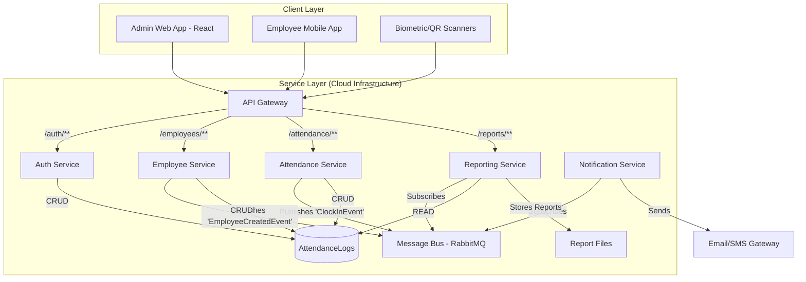

Of course. Here is a premium, investor-grade project blackbook for an "Attendance Management System," presented from the perspective of a Principal Software Architect.

---

# **Project Blackbook: Chronos Attendance Platform**

*   **Version:** 1.0
*   **Status:** Investor Review
*   **Author:** Principal Software Architect
*   **Date:** October 26, 2023

## 1. Key Selling Points & Value Proposition

Chronos is not merely an attendance tracker; it is an intelligent workforce management platform designed for the modern, distributed enterprise.

*   **Cloud-Native & Infinitely Scalable:** Built on a microservices architecture and deployed via Docker/Kubernetes, Chronos is engineered to support businesses from 10 to 100,000 employees without performance degradation.
*   **Multi-Modal Check-in:** We offer a flexible suite of attendance-capturing methods, including QR Code scanning, Geofenced mobile check-in, and Biometric (fingerprint/facial recognition) integration, effectively eliminating time theft and "buddy punching."
*   **Actionable, Real-Time Insights:** Go beyond simple presence tracking. Our analytics engine provides real-time dashboards on workforce punctuality, absenteeism trends, overtime costs, and project time allocation, empowering data-driven decision-making.
*   **Seamless Integration Ecosystem:** Chronos is built API-first. It seamlessly integrates with existing HRMS, Payroll (e.g., Gusto, ADP), and communication platforms (e.g., Slack, Microsoft Teams), creating a unified operational workflow and reducing administrative overhead by an estimated 40%.
*   **Bank-Grade Security & Compliance:** We prioritize data security with end-to-end encryption, role-based access control (RBAC), and a full audit trail for all actions. The system is designed to be compliant with data privacy regulations like GDPR and CCPA.

## 2. Abstract

The Chronos Attendance Platform is a sophisticated, cloud-native Software-as-a-Service (SaaS) solution designed to automate and optimize workforce attendance and time tracking. The system replaces archaic, error-prone manual processes and legacy hardware with a secure, scalable, and intelligent platform. Its core architecture is based on event-driven microservices, ensuring high availability, fault tolerance, and independent scalability of its components. The platform comprises a central API gateway, dedicated services for authentication, employee management, attendance logging, and reporting, all communicating via a message bus. This design allows for rapid feature development and integration with third-party systems. The primary technology stack includes Node.js (TypeScript) for the backend, React (Next.js) for the web-based administrative dashboard, PostgreSQL for structured data, and RabbitMQ for asynchronous communication, all containerized with Docker for predictable deployments across any cloud environment.

## 3. Architecture

The system is designed following a distributed, cloud-native microservices architecture. This model promotes loose coupling, high cohesion, and independent deployment cycles for each component.

### ### High-Level System Diagram (Mermaid Syntax)



### ### Technology Stack

*   **Backend Services:** Node.js, TypeScript, Express.js
*   **Frontend (Admin Portal):** React, Next.js, TailwindCSS
*   **Database:** PostgreSQL (Primary), Redis (Caching/Session Management)
*   **Containerization:** Docker, Docker Compose
*   **Orchestration (Production):** Kubernetes (AWS EKS / GKE)
*   **API Gateway:** NGINX / Kong
*   **Messaging Queue:** RabbitMQ
*   **CI/CD:** GitHub Actions
*   **Cloud Provider:** AWS (utilizing S3, RDS, EKS, SES)

## 4. Setup & Installation

The project is fully containerized, ensuring a consistent development environment and simplifying the setup process.

### ### Prerequisites

*   Git
*   Docker (v20.10+)
*   Docker Compose (v2.0+)
*   Node.js (v18.x) - For local script execution if needed

### ### Installation Steps

1.  **Clone the repository:**
    ```bash
    git clone https://github.com/chronos-platform/core.git
    cd core
    ```

2.  **Configure Environment Variables:**
    *   Copy the example environment file. This file contains all necessary configuration variables for the services.
    ```bash
    cp .env.example .env
    ```
    *   Edit the `.env` file and populate the secrets (Database credentials, JWT secret, API keys, etc.).

3.  **Build and Start Services:**
    *   Use Docker Compose to build the images and run all containers in detached mode.
    ```bash
    docker-compose up --build -d
    ```

4.  **Run Database Migrations:**
    *   Execute the migration script on the `employee-service` container to set up the initial database schema.
    ```bash
    docker-compose exec employee-service npm run db:migrate
    ```

The system is now running. The API Gateway will be accessible at `http://localhost:8080`.

## 5. File Structure

The project utilizes a monorepo structure to manage all microservices within a single repository, facilitating shared configurations and easier dependency management.

```
/chronos-platform/
├── .github/              # CI/CD workflows (GitHub Actions)
├── docs/                 # Documentation, architectural decision records
├── services/             # Contains all microservices
│   ├── api-gateway/      # NGINX configuration and routing
│   ├── auth-service/
│   │   ├── src/
│   │   ├── Dockerfile
│   │   └── package.json
│   ├── attendance-service/
│   │   ├── src/
│   │   │   ├── controllers/
│   │   │   ├── models/
│   │   │   ├── routes/
│   │   │   ├── services/
│   │   │   └── index.ts
│   │   ├── Dockerfile
│   │   └── package.json
│   └── ... (employee-service, reporting-service, etc.)
├── web-admin/            # React/Next.js frontend application
├── docker-compose.yml    # Orchestrates all services for local development
├── .env.example          # Template for environment variables
└── package.json          # Root package for monorepo scripts
```

## 6. Module Explanations

### ### API Gateway (`api-gateway`)
*   **Responsibility:** The single entry point for all client requests. It handles request routing, rate limiting, SSL termination, and initial authentication validation.
*   **Technology:** NGINX or Kong.

### ### Authentication Service (`auth-service`)
*   **Responsibility:** Manages user registration, login, password management, and JWT (JSON Web Token) generation/validation. Implements Role-Based Access Control (RBAC).
*   **Database Interaction:** Owns the `users`, `roles`, and `permissions` tables.

### ### Employee Service (`employee-service`)
*   **Responsibility:** Full CRUD (Create, Read, Update, Delete) operations for employee profiles, including personal data, department, role, and shift schedules.
*   **Database Interaction:** Owns the `employees`, `departments`, and `schedules` tables.

### ### Attendance Service (`attendance-service`)
*   **Responsibility:** The core business logic. Handles clock-in/clock-out events, calculates work duration, manages breaks, and flags anomalies (e.g., late arrival, early departure).
*   **Database Interaction:** Owns the `attendance_logs` and `leave_requests` tables.

### ### Reporting Service (`reporting-service`)
*   **Responsibility:** Generates periodic and on-demand reports (e.g., monthly attendance summaries, overtime reports). It listens for events from other services to maintain aggregated data for fast querying.
*   **Database Interaction:** Reads data from multiple service schemas and may maintain its own aggregated tables for performance.

## 7. How to Run

### ### Running the Full Stack

```bash
# Start all services in the background
docker-compose up -d

# Stop all services
docker-compose down
```

### ### Viewing Logs

```bash
# View logs for all services
docker-compose logs -f

# View logs for a specific service (e.g., attendance-service)
docker-compose logs -f attendance-service
```

### ### Running Tests

Tests are run inside the respective service container to ensure a consistent environment.

```bash
# Run unit and integration tests for the attendance-service
docker-compose exec attendance-service npm test
```

## 8. API Endpoint Examples

All requests are routed through the API Gateway. A valid JWT Bearer token is required for protected routes.

### ### User Login

*   **Endpoint:** `POST /auth/login`
*   **Description:** Authenticates a user and returns a JWT.
*   **Request Body:**
    ```json
    {
        "email": "admin@chronos.com",
        "password": "securepassword123"
    }
    ```
*   **Success Response (200 OK):**
    ```json
    {
        "accessToken": "eyJhbGciOiJIUzI1NiIsInR5cCI6IkpXVCJ9...",
        "refreshToken": "def50200..."
    }
    ```

### ### Clock In an Employee

*   **Endpoint:** `POST /attendance/clock-in`
*   **Description:** Records a clock-in event for an employee.
*   **Request Body:**
    ```json
    {
        "employeeId": "emp_a4b1c2d3",
        "timestamp": "2023-10-26T09:00:00Z",
        "method": "GEO_FENCE",
        "coordinates": {
            "latitude": 34.0522,
            "longitude": -118.2437
        }
    }
    ```
*   **Success Response (201 Created):**
    ```json
    {
        "logId": "log_xyz789",
        "employeeId": "emp_a4b1c2d3",
        "clockInTime": "2023-10-26T09:00:00Z",
        "status": "CLOCKED_IN"
    }
    ```

### ### Get Employee's Attendance for a Date Range

*   **Endpoint:** `GET /reports/employee/emp_a4b1c2d3?from=2023-10-01&to=2023-10-07`
*   **Description:** Retrieves a summary of an employee's attendance logs for a given period.
*   **Success Response (200 OK):**
    ```json
    {
        "employeeId": "emp_a4b1c2d3",
        "totalHoursWorked": 39.5,
        "daysPresent": 5,
        "daysAbsent": 0,
        "logs": [
            {
                "date": "2023-10-02",
                "clockIn": "2023-10-02T08:58:00Z",
                "clockOut": "2023-10-02T17:05:00Z",
                "hours": 8.12
            }
        ]
    }
    ```

## 9. Future Work

Our roadmap is focused on expanding our market lead through innovation and enterprise-grade features.

### ### Phase 2 (Next 6-9 Months)

*   **Native Mobile Applications (iOS & Android):** Dedicated apps for employees to clock-in/out, view schedules, and request leave.
*   **Third-Party Payroll Integration:** Direct API integrations with major payroll providers like ADP, Gusto, and QuickBooks Payroll to automate timesheet submission.
*   **Advanced Leave Management Module:** Complex accrual policies, approval workflows, and holiday calendars.

### ### Phase 3 (12-18 Months)

*   **AI-Powered Anomaly Detection:** A machine learning model to detect and flag suspicious patterns, such as "buddy punching" (e.g., two clock-ins from the same device in rapid succession for different employees) or abnormal clock-in locations.
*   **Biometric Hardware Integration:** Official SDKs and firmware support for common biometric fingerprint and facial recognition scanners.
*   **Project-Based Time Tracking:** Allow employees to allocate their time to specific projects or tasks for granular cost analysis.

### ### Phase 4 (24+ Months)

*   **Full Multi-Tenancy Architecture:** Restructure the platform to support isolated client environments, enabling more efficient resource utilization and opening up reseller/white-label opportunities.
*   **On-Premise Deployment Option:** A Kubernetes-packaged version of Chronos for enterprise clients with strict data residency requirements.
*   **Predictive Scheduling & Workforce Analytics:** Leverage historical data to predict staffing needs, optimize schedules, and minimize overtime costs.